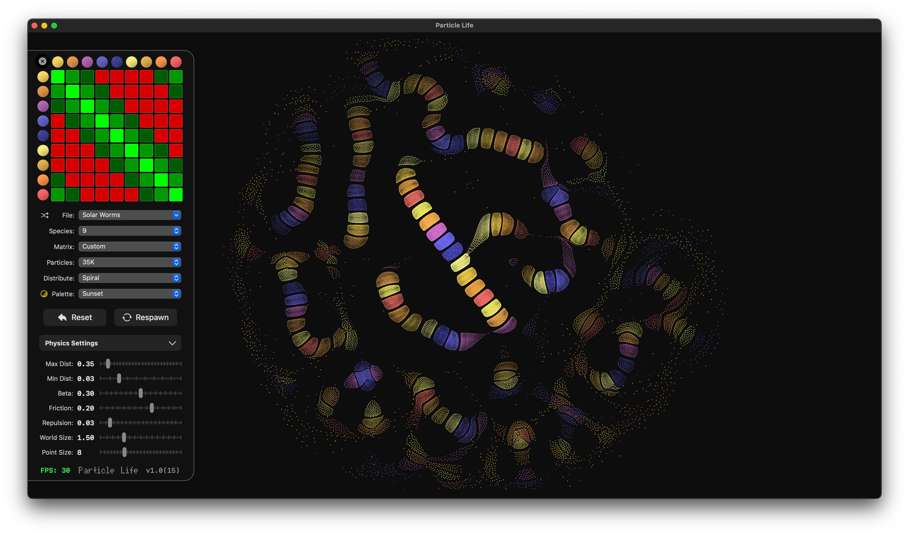

# Particle Life

Particle Life is a GPU-accelerated particle simulation written in **SwiftUI & Metal**, inspired by Jeffery Ventrella’s "Artificial Life" experiments. The simulation models thousands of particles interacting based on an **interaction matrix**, creating emergent behavior.

## Features
- ⚡ **Metal-Accelerated**: Runs smoothly with **50,000+ particles**.
- 🎨 **Custom Interaction Matrix**: Define attraction/repulsion between species.
- 🖥 **SwiftUI UI**: Intuitive controls for tweaking simulation parameters.
- 🔧 **Dynamic Editing**: Adjust forces, species count, and behaviors in real-time.

## Controls
- **Matrix Editor**: Click or scroll to modify interactions.
- **Presets**: Save and load custom configurations.
- **Simulation Parameters**: Adjust distance thresholds, friction, and particle size.

## Installation
Clone the repo and open the project in Xcode:
```sh
git clone https://github.com/chessboy/particle-life.git
cd particle-life
open ParticleLife.xcodeproj
```
